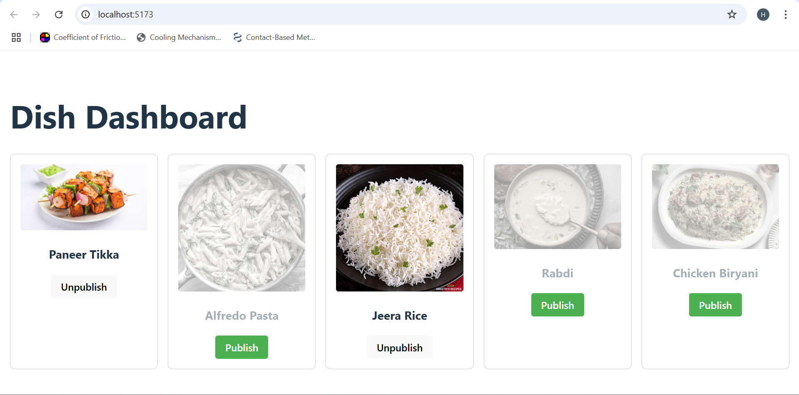

# 🍽️ Real-Time REST API Backend with MongoDB Change Streams & Socket.IO

This project is a **Node.js + Express backend** that provides a REST API for managing dishes and supports **real-time updates** via Socket.IO and MongoDB Change Streams.

It is designed as a **reference implementation** for creating real-time apps where clients automatically receive updates when data changes in the database.

---

## ✨ Features

✅ Fetch the list of dishes  
✅ Toggle the published status of a dish  
✅ Real-time broadcasting of updates to all connected clients  
✅ MongoDB Change Streams for efficient event detection  

---

## 🛠️ Tech Stack

- **Node.js**
- **Express.js**
- **MongoDB Atlas**
- **Mongoose**
- **Socket.IO**

---

## 📂 Folder Structure

```

📁 models/
dish.js          # Mongoose model for dishes
server.js            # Main application entry point

````

---

## 📑 API Endpoints

| Method | Endpoint              | Description                      |
|--------|-----------------------|----------------------------------|
| GET    | `/api/dishes`         | Retrieve all dishes              |
| PATCH  | `/api/dishes/:id/toggle`     | Toggle the published status      |

---

## ⚡ Real-Time Updates

This backend uses **MongoDB Change Streams** to listen for changes in the `dishes` collection. When a dish is updated (e.g., published/unpublished), an event (`dishUpdated`) is emitted to **all connected Socket.IO clients**, who can then re-fetch data or update their UI automatically.

---

## 🚀 Getting Started

### 1️⃣ Clone the repository

```bash
git clone https://github.com/surefire01/rt-updates-api.git
cd rt-updates-api
````

---

### 2️⃣ Install dependencies

```bash
npm install
```

---

### 3️⃣ Configure environment variables

Create a `.env` file in the project root:

```
MONGODB_URI=mongodb+srv://<username>:<password>@cluster0.mongodb.net/your-database-name
PORT=8000
```

Make sure your MongoDB Atlas cluster is **whitelisted for your IP**.

---

### 4️⃣ Start the server

```bash
npm run dev
```

or

```bash
node server.js
```

---

✅ **Server should start on `http://localhost:8000`.**

---

## 🖥️ Example Requests

**Fetch dishes**

```http
GET /api/dishes
```

**Toggle publish status**

```http
PATCH /api/dishes/64f3f1234abcdef12345678
```

---

## 🔌 Socket.IO Events

**Server emits:**

| Event Name    | Payload | Description                  |
| ------------- | ------- | ---------------------------- |
| `dishUpdated` | (none)  | Indicates a dish was changed |

Clients should listen for `dishUpdated` and re-fetch the dishes list.

---

## 🧩 How to Use in a Frontend App

1. Connect to the backend via Socket.IO:

   ```javascript
   const socket = io("http://localhost:8000");
   ```
2. Listen for updates:

   ```javascript
   socket.on("dishUpdated", () => {
     // Re-fetch dishes or update UI
   });
   ```
3. Make REST calls to toggle or retrieve dishes.

---

## 🌱 Extending This Project

This backend is a great starting point for building real-time apps. You could easily extend it to support:

* Authentication and authorization
* More granular event payloads (send changed document)
* Additional CRUD operations
* Webhook integrations
* Production deployment (e.g., Render, Heroku)

---

## ✨ Demo



---

## 🙌 Credits

* [MongoDB Documentation](https://www.mongodb.com/docs/)
* [Socket.IO Documentation](https://socket.io/docs/)

---

## 📄 License

MIT

---

